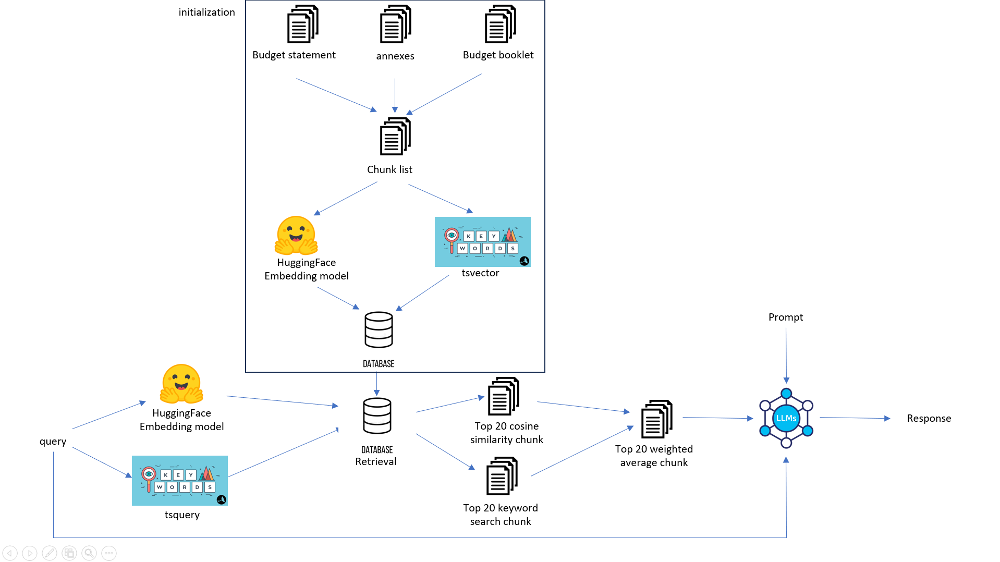

# Singapore Financial Budget 2024 AI chatbot assistant

## Description

This project is an AI-powered chatbot utilizing OpenAI's ChatGPT model and a Retrieval-Augmented Generation (RAG) pipeline to enhance response accuracy and relevance.

## Getting Started
### Installation
Follow these steps to install the chatbot
```
# Clone the repository
git clone https://github.com/geoffong11/budget-chatbot.git
cd budget-chatbot
```
### Configuration

Update the `.env` file with your ChatGPT API key and PostgreSQL database password

### Running the Chatbot

To run the chatbot, open docker desktop, and run:
```
docker-compose up
```
Go to `localhost:8501` and chat away!

## RAG Pipeline
### Illustration


### Tech Stack
Frontend: Streamlit

Backend: Flask

database: PostgreSQL database (pgvector)

### Implementation

#### Models used
Embedding model used: `all-mpnet-base-v2` from `Sentence-Transformers`\
LLM used: `gpt-4o` from `openai`

#### Chunking
I use different chunking strategies depending on the document type:

- Budget Statement: I chunk by the numbered list, as each numbered section corresponds to a distinct point. This segmentation preserves the document's natural structure and meaning.
- Budget Booklet: I chunk by pages since most information on financial packages or payouts is self-contained within a single page for readability.
- Annexes: Given their document-like nature, I use overlapping chunking to maintain context and coherence.

For both the Budget Statement and Budget Booklet, if a page or segment exceeds the maximum sequence length of the sentence transformer (384 tokens), I apply overlapping chunking to ensure no critical information is lost.

#### Retrieval strategy
I use Hybrid Search for retrieval, which combines Vector Search and BM25 (Best Match 25) Keyword Search, to combine the strengths of both methods. Vector Search captures semantic similarity, making it effective for retrieving contextually relevant documents even when exact terms are not matched. Meanwhile, BM25 excels at retrieving documents based on exact keyword occurrences, ensuring high precision when specific terms are important. 

#### Generation and prompting strategy
I make use of system, user and assistant prompts.
- For system prompts, I prompted the LLM to act like a Singapore Budget 2024 expert, and told the LLM to have a professional tone.
- For user prompts, I include the documents that I retrieved and the query. In order to prevent hallucination, I explicitly told the LLM not to answer if the query is not relevant to the documents.
- For assistant prompt, I use few-shot prompting as it gives the LLM a template for it to work with. From trial-and-error, I realized that without the template, the LLM will answer the questions in many different ways, which may not be ideal.
